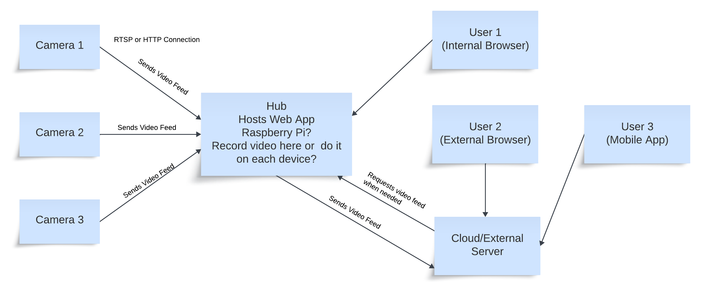

Devices Used:

ESP32-CAM - https://www.amazon.com/dp/B09TB1GJ7P?ref=ppx_yo2ov_dt_b_product_details&th=1

FTDI Adapter - https://www.amazon.com/dp/B00IJXZQ7C?psc=1&ref=ppx_yo2ov_dt_b_product_details

Jumpers - https://www.amazon.com/dp/B01EV70C78?psc=1&ref=ppx_yo2ov_dt_b_product_details

Development env:
VS Code with PlatformIO extension.

Pin connections:
| ESP32-CAM | FTDI Adapter |
|-----------|--------------|
|    UOT    |      RX      |
|    UOR    |      TX      |
|    VCC    |      3V3     |
|    GND    |      GND     |

For Deployment/Upload, connect IO0 to GND on the ESP32-CAM and press the RST button.
When finished deploying, dissconnect the IO0 to GND pins and press RST button.

To connect to Wifi, copy credentials_template.h to credentials.h and update SSID and Password.

High level concept map:
https://lucid.app/lucidspark/15fd542f-7d08-480f-bd5f-1fec46ea0914/edit?viewport_loc=-2721%2C-1155%2C4661%2C2231%2C0_0&invitationId=inv_274d855a-f8f2-41c7-aaae-fa8b75bd8e9a

